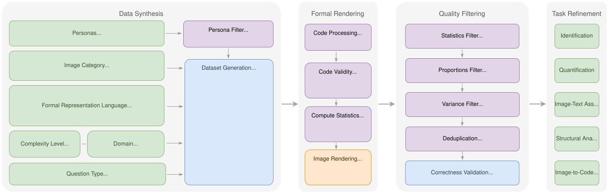

# STRUDEL


STRUDEL (**STRU**ctured **D**iagram **E**va**L**uation) is a benchmark and source-code repository for evaluating Vision-Language Models (VLMs) on structured diagram understanding across domains. It targets diagram types that are central to scientific and engineering communication, including circuit schematics, molecular structures, musical notation, business process flowcharts, and class diagrams.

This repository contains the code used to build, filter, and evaluate the benchmark introduced in the paper *"STRUDEL: Unrolling a Benchmark for Evaluating Vision-Language Models on Structured Diagram Understanding Across Domains"*. STRUDEL uses Large Language Models (LLMs) to synthesize domain-specific Formal Representation Language (FRL) code, renders it into valid diagrams via **[Structivize](https://github.com/danielsteinigen/structivize)**, and pairs those diagrams with generated tasks, functional descriptions, and captions for downstream benchmarking.

## Features
- 🌍 Benchmark coverage across 8 domains and 20 image categories for structured diagram understanding
- 🧱 FRL-driven data generation pipeline that synthesizes domain-specific code and renders valid diagrams with [Structivize](https://github.com/danielsteinigen/structivize)
- 📝 Context-rich benchmark samples pairing diagrams with generated tasks, functional descriptions, captions, and formal code representations
- ✅ Multi-stage quality control with rendering validation, filtering for invalid or cluttered samples, deduplication, and LLM-as-a-judge scoring
- 🧪 Evaluation tooling for analyzing how well LLMs generate valid FRL code across diagram types
- 👁️ Benchmark evaluation for VLMs across identification, quantification, structural analysis, image-text association, and image-to-code translation tasks
- 🔁 Reproducible end-to-end workflow for persona generation, dataset synthesis, rendering, filtering, scoring, refinement, and test-set evaluation

## Publications
- **STRUDEL: Unrolling a Benchmark for Evaluating Vision-Language Models on Structured Diagram Understanding Across Domains** — LREC 2026. [DOI](https://doi.org/10.63317/33jqjf2wspgp)

## Datasets
- 📦 STRUDEL Dataset: [Huggingface](https://huggingface.co/datasets/danielsteinigen/STRUDEL)
- 📦 Personas Dataset: (add link)

## Flowchart

The following diagrams summarize the high-level workflow design.



## Installation

Create virtual Python environment e.g. using uv:
```
curl -LsSf https://astral.sh/uv/install.sh | sh
uv venv --python 3.12
source .venv/bin/activate
```

Install dependencies via optional groups (recommended):
```bash
uv pip install -e ".[datagen]"
uv pip install -e ".[all]"
```

After installation, the `strudel` command is available. During local development, you can also run commands with:
```bash
PYTHONPATH=src python -m strudel --help
```

Alternative (legacy):
```bash
uv pip install -r requirements.txt
```

Install Structivize (required for rendering). Follow the setup in the Structivize repo:
https://github.com/danielsteinigen/structivize


## Usage

STRUDEL now exposes a top-level CLI so the workflow can be run as a step-by-step pipeline.

Discover available commands with:
```bash
strudel --help
strudel <group> --help
```

### Command groups overview

| Group | Command | Purpose |
| --- | --- | --- |
| personas | strudel personas generate | Generate raw persona candidates from FineWebEdu |
| personas | strudel personas query | Generate category-specific semantic search queries |
| personas | strudel personas filter | Filter persona candidates into category-aligned subsets |
| dataset | strudel dataset generate | Generate problem-solution samples |
| dataset | strudel dataset render | Render generated FRL code to images through Structivize |
| dataset | strudel dataset filter | Filter generated samples using quality gates |
| dataset | strudel dataset score | Run LLM-as-a-Judge scoring |
| dataset | strudel dataset split | Split scored datasets for refinement stages |
| dataset | strudel dataset qa | Generate QA refinement samples |
| dataset | strudel dataset caption | Generate caption refinement samples |
| dataset | strudel dataset assemble | Assemble all refined subsets into one training dataset |
| eval | strudel eval codegen | Evaluate code-generation outputs by FRL |
| eval | strudel eval strudel | Evaluate a VLM on the STRUDEL benchmark from a VLM config |
| eval | strudel eval codetrans | Render and score code-translation outputs from STRUDEL evaluation |

## Data generation

### Persona generation
Generate persona descriptions from FineWebEdu:
```bash
strudel personas generate \
    --config src/strudel/configs/llm/qwen-3-235b-instruct.yaml \
    --output personas.jsonl \
    --data-batch-size 50000
```

Generate search queries to find appropriate personas for each image category:
```bash
strudel personas query \
    --config src/strudel/configs/llm/qwen-3-235b-instruct.yaml \
    --input diagram_categories.json \
    --output personas_query.jsonl \
    --data-batch-size 50000
```

Filter the persona dataset per image category:
```bash
strudel personas filter \
    --input personas.jsonl \
    --output personas_filtered \
    --query-path data/categories_all.json
```

### Data generation
Generate dataset using the personas as input:
```bash
strudel dataset generate \
    --config src/strudel/configs/llm/qwen-3-coder-480b-instruct.yaml \
    --input personas_filtered.jsonl \
    --output strudel_generations.jsonl \
    --data-batch-size 50000
```

#### Rendering
Render images for each generated sample:
```bash
strudel dataset render \
    --render-script /path/to/structivize/src/structivize/render_batch.py
```

### Filtering
Filter the generated vision-language dataset according to different criteria:
```bash
strudel dataset filter \
    --input-dirs path/to/render_run_1 path/to/render_run_2 \
    --output-dir dataset_filtered
```

Perform LLM-as-a-Judge scoring to retrieve high quality samples:
```bash
strudel dataset score \
    --config src/strudel/configs/llm/gpt-oss-120b.yaml \
    --input dataset_filtered/dataset.jsonl \
    --output dataset_score.jsonl \
    --data-batch-size 50000
```

Split the dataset into subgroups for generating different question types:
```bash
strudel dataset split \
    --qa-input-dirs path/to/qa_score_dir \
    --ps-input-dirs path/to/ps_score_dir \
    --output-dir dataset_split
```

### Refinement
Generate closed-ended questions for a subset of the dataset:
```bash
strudel dataset qa \
    --config src/strudel/configs/llm/qwen-3-coder-480b-instruct.yaml \
    --input dataset_split/dataset_llm_qa_gen.jsonl \
    --output dataset_cec.jsonl \
    --data-batch-size 50000
```

Generate captions for a subset of the dataset:
```bash
strudel dataset caption \
    --config src/strudel/configs/llm/qwen-3-coder-480b-instruct.yaml \
    --input dataset_split/dataset_ps_caption.jsonl \
    --output dataset_captions.jsonl \
    --data-batch-size 50000
```

Assemble the subsets of the different question types into a single training dataset:
```bash
strudel dataset assemble \
    --input-dir dataset_split \
    --output-dir dataset_assembled
```


## Evaluation
Evaluate the performance of LLMs in generating code in specific FRLs:
```bash
strudel eval codegen \
    --input-dirs path/to/render_run_1 path/to/render_run_2
```

Evaluate a VLM on the STRUDEL benchmark using one of the configs in `src/strudel/configs/vlm`:
```bash
strudel eval strudel \
    --config src/strudel/configs/vlm/qwen2.5-vl.yaml \
    --output results/qwen2.5-vl
```

Render and score the code-translation subset from one or more `strudel eval strudel` prediction files using Structivize:
```bash
strudel eval codetrans \
    --input-files results/qwen2.5-vl.json \
    --output-dir results/code-translation \
    --gold-statistics data/gold_statistics.json
```


## Citation

If you use STRUDEL, please cite:

```bibtex
@inproceedings{steinigen-etal-2026-strudel,
    title = {STRUDEL: Unrolling a Benchmark for Evaluating Vision-Language Models on Structured Diagram Understanding across Domains},
    author = {Steinigen, Daniel and Flek, Lucie and Houben, Sebastian},
    booktitle = {Proceedings of the Fifteenth Language Resources and Evaluation Conference (LREC 2026)},
    month = {May},
    year = {2026},
    pages = {11085--11107},
    address = {Palma, Mallorca, Spain},
    publisher = {European Language Resources Association (ELRA)},
    doi = {10.63317/33jqjf2wspgp}
}
```


## License

This project is licensed under the MIT License. See [LICENSE](LICENSE).
